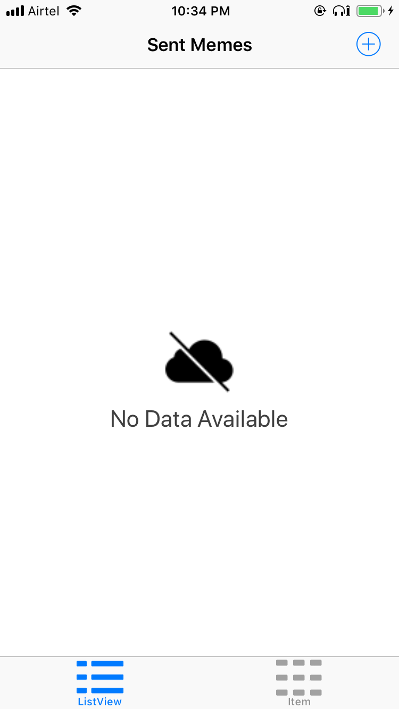
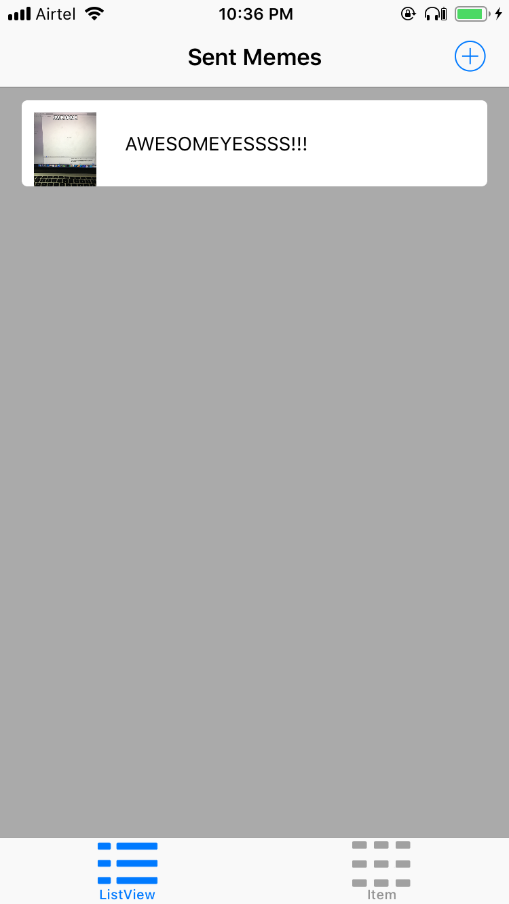
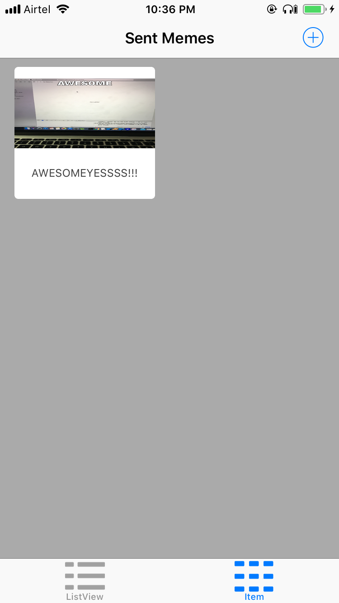
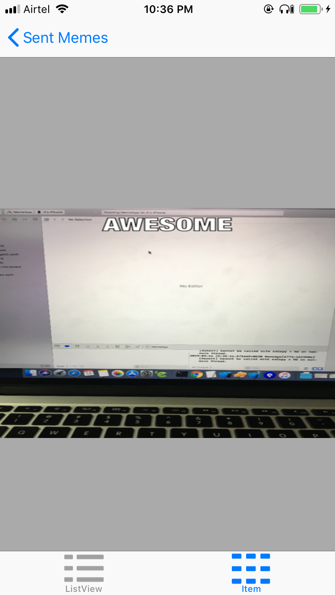
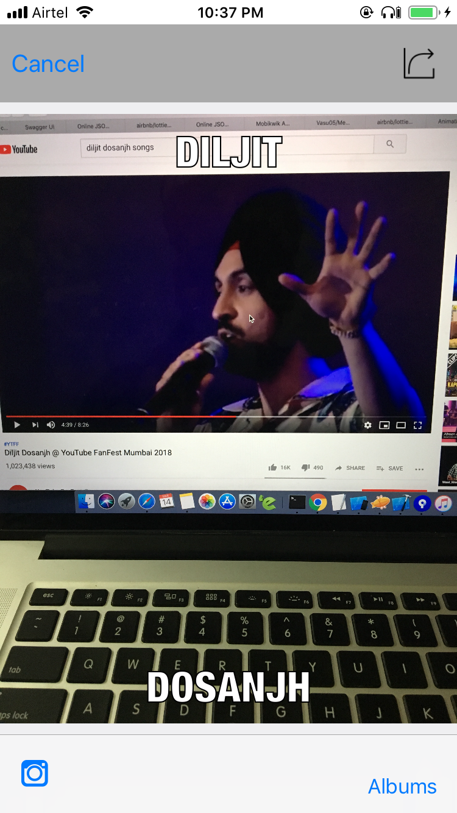
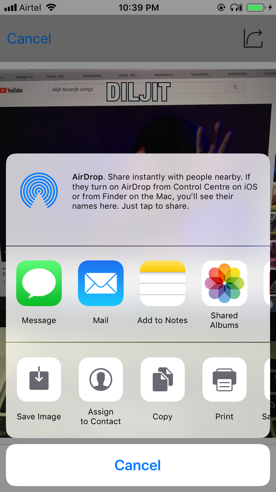

# Create Funny Images 
iOS App that enables a user to take a picture, and add text at the top and bottom to form a meme, and share that meme on Facebook and Twitter and also by SMS or email. In this project, sent memes will appear in a tab view with two tabs: a table view and a collection view

###### Home page - No Data 

###### Home page - Tableview 

###### Home page - CollectionView 

###### Home page - CollectionView 

###### Image DetailView 

###### Image Editor 

###### Image Share 

